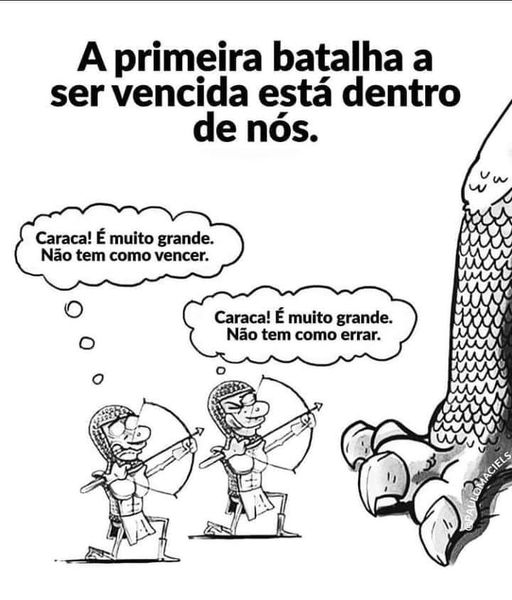
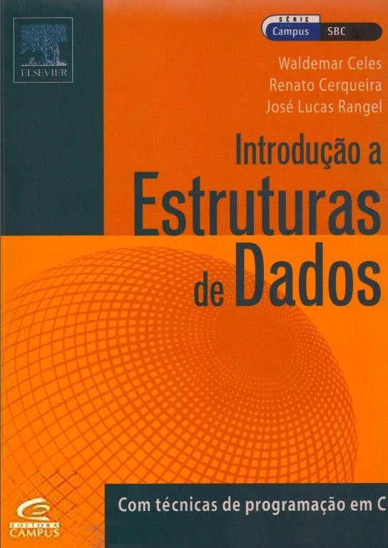
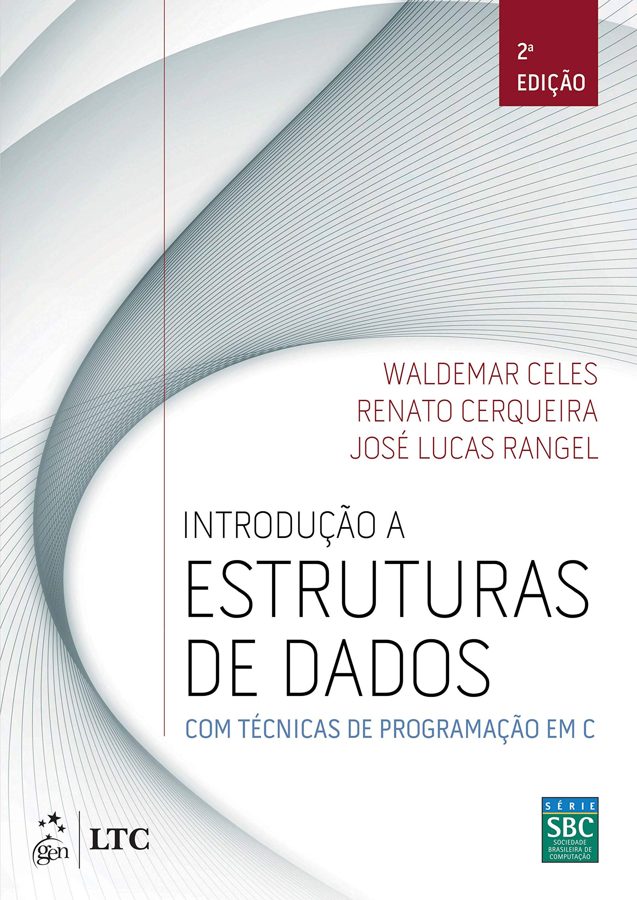
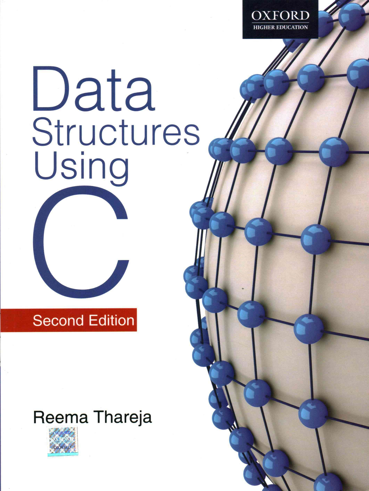

# Estrutura de Dados

Prof. Eduardo Ono

 

## Descrição

Estruturas de dados dinâmicas, lineares e não lineares em linguagem C.

 

## [Conteúdo Programático](./conteudo/README.md)

| Aula | Data | Conteúdo |
| :-:  | :-:  | ---      |
| [01] | 18/02 | Introdução a Estrutura de Dados; Revisão dos pré-requisitos
| [02] | 25/02 | Memória "Stack" e memória "Heap"; Alocação Dinâmica de Memória; Estruturas em C (struct)
| [03] | 04/03 | Vetores Estáticos e Dinâmicos
| [04] | 11/03 | CRUD com Vetores Dinâmicos
| [05] | 18/03 | Listas Simplesmente Encadeadas; CRUD com Lista Encadeada
| [06] | 25/03 | Pilhas e Filas
| [07] | 01/04 | Listas Duplamente Encadeadas; Listas Circulares e Revisão de Recursão
| 08 | 08/04 | __1a. Avaliação__
| 09 | 29/04 | Ordenação
| 10 | 06/05 | Árvores Binárias e Árvores Binárias de Busca
| 11 | 13/05 | Árvores Balanceadas
| 12 | 20/05 | Algoritmos de Ordenação
| 13 | 27/05 | Teoria dos Grafos
| 14 | 03/06 | __2a. Avaliação__ (A ser confirmada)
| 15 |  |

[01]: ./aulas/README.md#aula-01
[02]: ./aulas/README.md#aula-02
[03]: ./aulas/README.md#aula-03
[04]: ./aulas/README.md#aula-04
[05]: ./aulas/README.md#aula-05
[06]: ./aulas/README.md#aula-06
[07]: ./aulas/README.md#aula-07

 

## Pré-Requisitos

* [Introdução à Programação](https://github.com/eduardo-ono/Introducao-a-Programacao)

* Arquitetura e Organização de Computadores (Opcional)

 

## Recursos

* GCC (Compilador C/C++) e Depurador GDB

* Microsoft Visual Studio Code (Editor)

 

## Bibliografia Básica

| Capa | Título |
| :-:  | ---    |
|  | [CELES_2004] CELES, W.; CERQUEIRA, R.; RANGEL, J. R. [Introdução a Estruturas de Dados - Com Técnicas de Programação em C](https://archive.org/details/introducaoaestruturadedados/), Campus, 2004.
|  | [CELES-2e_2016] CELES, W.; CERQUEIRA, R.; RANGEL, J. R. Introdução a Estruturas de Dados - Com Técnicas de Programação em C, 2. ed., GEN LTC, 2016.

 

## Bibliografia Complementar

| Capa | Título |
| :-:  | ---    |
|  | [REESE_2013] REESE, Richard. __Understanding and Using C Pointers__, O'Reilly Media, 2013[.](https://app.box.com/s/cbp98oofhokip0yki3gh7khz6zb6htgq)
|  | [THAREJA-2e_2014] THAREJA, Reema; __Data Structures Using C__, New Delhi : Oxford University Press, 2014.
|  | [GRONER-2e_2018] GRONER, Loiane; __Estruturas de Dados e Algoritmos em JavaScript__, São Paulo : Novatec, 2018.

 

## Vídeos Recomendados

| Thumb | Descrição |
| :-: | --- |
|  | [CACiC FCT-Unesp] [Bate-papo com Fabio Akita](https://www.youtube.com/watch?v=i_STkDJ3z5s) (1:42:40, YouTube, Mar/2022)
|  | [60 second] [Um grupo de cinco macacos e dois cientistas](https://www.youtube.com/watch?v=ZAQtwFpkksw) (1:50, YouTube, Fev/2013)

 

## Filmes e Documentários Recomendados

| Thumb | Descrição |
| :-: | --- |
|  | __Jobs__ (2013)
|  | __Steve Jobs__ (2015)
|  | [Apple Explained] __History of Steve Jobs (Full Documentary)__ (1:06:03, YouTube, Mar/2021)

 
