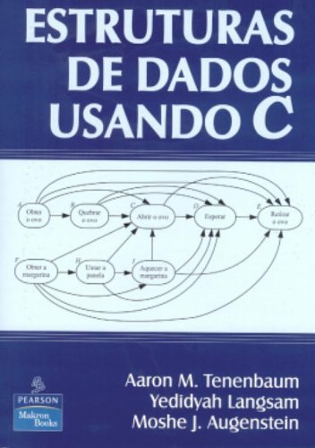
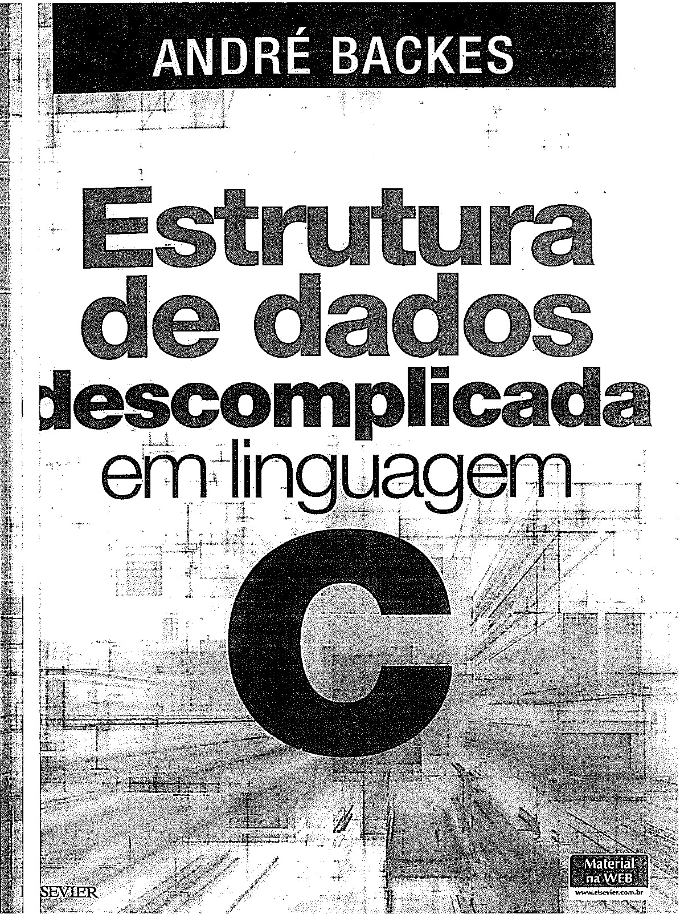
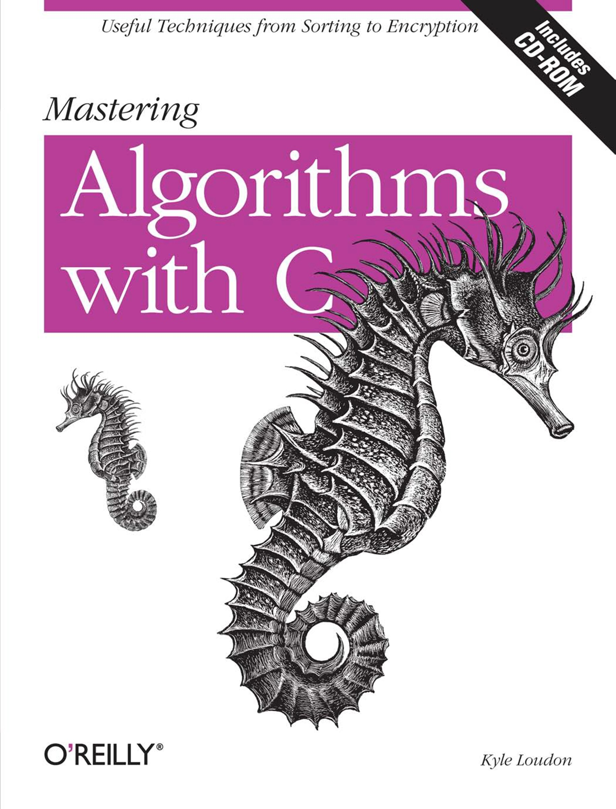

 
<h1 align="center">
Estrutura de Dados
</h1>
<h4 align="center">
Prof. Eduardo Ono
</h4>

 

 

## Descrição

Estruturas de dados dinâmicas, lineares e não lineares em linguagem C.

 

## [Conteúdo Programático](./conteudo/README.md)

| Aula | Data | Conteúdo |
| :-:  | :-:  | ---      |
| [01] | 18/02 | Introdução a Estrutura de Dados; Revisão de Ponteiros
| [02] | 25/02 | Estruturas (struct); Memória "Stack" e memória "Heap"; Alocação Dinâmica de Memória
| [03] | 04/03 | Vetores Estáticos e Dinâmicos
| [04] | 11/03 | CRUD com Vetores Dinâmicos
| [05] | 18/03 | Listas Simplesmente Encadeadas; CRUD com Listas Encadeadas
| [06] | 25/03 | Pilhas e Filas
| [07] | 01/04 | Listas Duplamente Encadeadas; Listas Circulares e Revisão de Recursão
| 08 | 08/04 | __1a. Avaliação__
| 09 | 29/04 | Ordenação
| 10 | 06/05 | Árvores Binárias e Árvores Binárias de Busca
| 11 | 13/05 | Árvores Balanceadas
| 12 | 20/05 | Algoritmos de Ordenação
| 13 | 27/05 | Teoria dos Grafos
| 14 | 03/06 | __2a. Avaliação__ (A ser confirmada)
| 15 |       | Hashing
| 16 |       | Análise de Algoritmos; Notação Big-"O"
| 17 |       | Introdução à Criptografia

[01]: ./aulas/README.md#aula-01
[02]: ./aulas/README.md#aula-02
[03]: ./aulas/README.md#aula-03
[04]: ./aulas/README.md#aula-04
[05]: ./aulas/README.md#aula-05
[06]: ./aulas/README.md#aula-06
[07]: ./aulas/README.md#aula-07

 

## Pré-Requisitos

* [Introdução à Programação](https://github.com/eduardo-ono/Introducao-a-Programacao)

* Arquitetura e Organização de Computadores (Opcional)

 

## Recursos

* GCC (Compilador C/C++) e Depurador GDB

* Microsoft Visual Studio Code (Editor)

 

## Material de Apoio

| Thumb | Descrição |
| --- | --- |
|  | [Programação Descomplicada Linguagem C] [Estrutura de Dados Descomplicada](https://www.youtube.com/playlist?list=PL8iN9FQ7_jt6H5m4Gm0H89sybzR9yaaka) (140 vídeos, YouTube, Mar/2022)
|  | [Professor Rafael Ivo] [Programação em C](https://www.youtube.com/playlist?list=PLvat2X-KHJNZwUCeTeve_S1qqrBOWhaU9) (14 vídeos, ~3 horas, YouTube, Nov/2020)
|  | [Bóson Treinamentos] [Curso de Programação em Linguagem C](https://www.youtube.com/playlist?list=PLucm8g_ezqNqzH7SM0XNjsp25AP0MN82R) (25 vídeos, YouTube, Jul/2021)

 

## Bibliografia Básica

| Capa | Título |
| :-:  | ---    |
|  | [TENENBAUM_1995] TENENBAUM, Aaron M.; LANGSAM, Yedidyah; AUGENSTEIN, Moshe J.  <strong>[Estruturas de Dados Usando C](https://www.cin.ufpe.br/~garme/public/(ebook)Estruturas%20de%20Dados%20Usando%20C%20(Tenenbaum).pdf)</strong>. 1. ed. São Paulo: MAKRON Books, 1995.
|  | [BACKES_2016] BACKES, André. <strong>Estrutura de Dados Descomplicada em Linguagem C</strong>. 1. ed. Rio de Janeiro: Elsevier, 2016[.](https://app.box.com/s/5x0rmierd1unonsdp7ox9iuwg3vskekc)
|  | [CELES-2e_2016] CELES, W.; CERQUEIRA, R.; RANGEL, J. R. Introdução a Estruturas de Dados - Com Técnicas de Programação em C, 2. ed. GEN LTC, 2016.
|  | [CELES_2004] CELES, W.; CERQUEIRA, R.; RANGEL, J. R. [Introdução a Estruturas de Dados - Com Técnicas de Programação em C](https://archive.org/details/introducaoaestruturadedados/). Campus, 2004.

 

## Bibliografia Complementar

| Capa | Título |
| :-:  | ---    |
|  | [THAREJA-2e_2014] THAREJA, Reema. __Data Structures Using C__. New Delhi: Oxford University Press, 2014.
|  | [LOUDON_1999] LOUDON, Kyle. __Mastering Algorithms with C__. Sebastopol: O’Reilly Media, 1999.
|  | [REESE_2013] REESE, Richard. __Understanding and Using C Pointers__. O'Reilly Media, 2013[.](https://app.box.com/s/cbp98oofhokip0yki3gh7khz6zb6htgq)
|  | [SEDGEWICK_2011] SEGEWICK, Robert; WAYNE, Kevin. [__Algorithms__](https://algs4.cs.princeton.edu/home/). Addison-Wesley, 2011.
|  | [GRONER-2e_2018] GRONER, Loiane; __Estruturas de Dados e Algoritmos em JavaScript__. São Paulo: Novatec, 2018[.](https://app.box.com/s/ad9284w4gaxfyi3s6jtngy9i2wjnnx2k)

 

## Vídeos Recomendados

| Thumb | Descrição |
| :-: | --- |
|  | [CACiC FCT-Unesp] [Bate-papo com Fabio Akita](https://www.youtube.com/watch?v=i_STkDJ3z5s) (1:42:40, YouTube, Mar/2022)
|  | [60 second] [Um grupo de cinco macacos e dois cientistas](https://www.youtube.com/watch?v=ZAQtwFpkksw) (1:50, YouTube, Fev/2013)

 

## Filmes e Documentários Recomendados

| Thumb | Descrição |
| :-: | --- |
|  | __Jobs__ (2013)
|  | __Steve Jobs__ (2015)
|  | [Apple Explained] __History of Steve Jobs (Full Documentary)__ (1:06:03, YouTube, Mar/2021)

 
