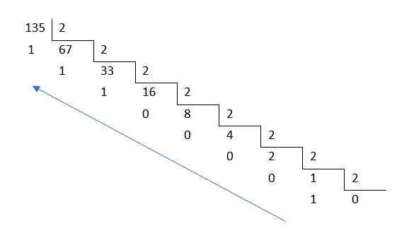

> ##### Estrutura de Dados > Projetos em C

# dec2bin

Prof. Eduardo Ono

 

## Descrição

* Programa para converter um número inteiro positivo no sistema decimal para o sistema binário, fazendo uso de uma lista simpesmente encadeada de números inteiros (apenas zeros e uns, nesse caso).

 

## Características do Problema

* Os algarismos do número binário podem ser obtidos através dos  restos das divisões sucessivas dos quocientes por 2. Contudo, a sequência dos restos deve ser lida do fim para o início.

 

## Exemplo

* Conforme a ilustração a seguir, o decimal 135 é convertido para 10000111 no sistema binário:

  

 

## Características da Solução Utilizando-se uma Lista Simplesmente Encadeada

* Quando o resto de uma das divisões sucessivas é calculado, o mesmo é adicionado no início da lista encadeada. Ao final das divisões, o último resto será o primeiro da lista, ou seja, os restos são armazenados na sequência correta de formação do número binário.

 

## Características do Programa

* O programa utiliza uma "biblioteca" para listas simplesmente encadeadas, que é o arquivo `linkedList.c` contendo várias funções prontas para facilitar a manipulação da lista. Esse arquivo está localizado no diretório `lib`, e deve estar presente durante a compilação do programa.

 
